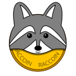

# Raccoin

### Crypto Portfolio and Tax Reporting Tool

Raccoin makes it easy to see the current state and the history of your crypto
portfolio and generates relevant reports for declaring capital gain income tax.
It currently works in EUR using the FIFO method, but since it is open source
anyone can extend it to suit their needs.

## Supported Formats

### CSV Formats

Raccoin can import CSV files exported from the following sources:

* [Binance](https://www.binance.com/) (exchange)
* [Bitcoin Core](https://bitcoin.org/en/bitcoin-core/) (desktop wallet)
* [Bitcoin.de](https://www.bitcoin.de/de) (exchange)
* [Bitstamp](https://www.bitstamp.net/) (exchange)
* [Bittrex](https://bittrex.com/) (exchange) (order and transaction history for disabled accounts)
* [CrypTaxCalculator](https://cryptotaxcalculator.io/) custom [CSV import format](https://help.cryptotaxcalculator.io/en/articles/5777675-advanced-manual-custom-csv-import)
* [Electrum](https://www.electrum.org/) (desktop wallet)
* [Mycelium](https://wallet.mycelium.com/) (mobile wallet)
* [Peercoin](https://www.peercoin.net/wallet) (desktop wallet)
* [Poloniex](https://poloniex.com/) (exchange)
* [Reddcoin](https://www.reddcoin.com/reddwallet.html) (desktop wallet)
* [Trezor Suite](https://trezor.io/trezor-suite) (desktop and web wallet)

### Blockchains

Raccoin can also synchronize wallets from certain blockchains directly. Currently, adding these wallets requires manually editing the portfolio JSON file since the UI for adding them still needs to be written. Supported are:

* Bitcoin wallets based on one or more addresses
* Bitcoin wallets based on one or more xpub, ypub and zpub addresses
* Ethereum wallets
* Stellar accounts

### JSON

Transactions can be exported to JSON and can also be imported from that format again.

## Attribution

This application was written in [Rust](https://www.rust-lang.org/) using the excellent [Slint UI framework](https://slint.dev/).

[Codeium](https://codeium.com) has been a major help, especially since I was still relatively new to Rust.

Thanks to my wife for suggesting "Raccoin", which is a combination of "raccoon" and "coin". Raccoons are known to be smart animals, and you'd be smart to use Raccoin!

The icon is an adaptation of the <a href="https://publicdomainvectors.org/en/free-clipart/Raccoon-wild-animal/87895.html">Raccoon wild animal</a> image at [publicdomainvectors.org](https://publicdomainvectors.org/).

